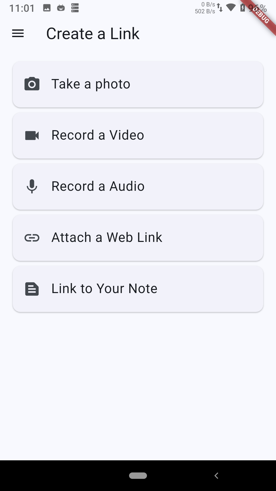
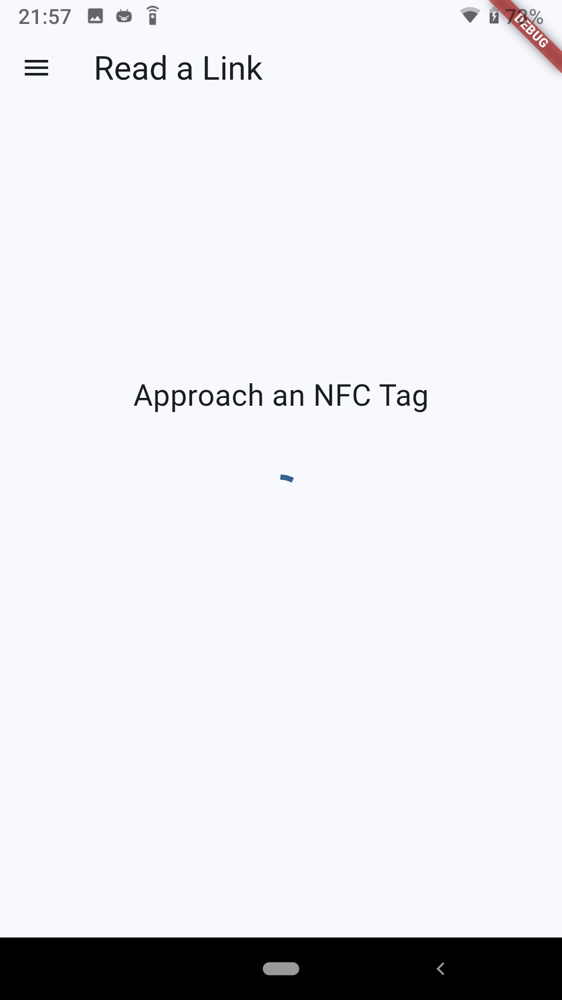
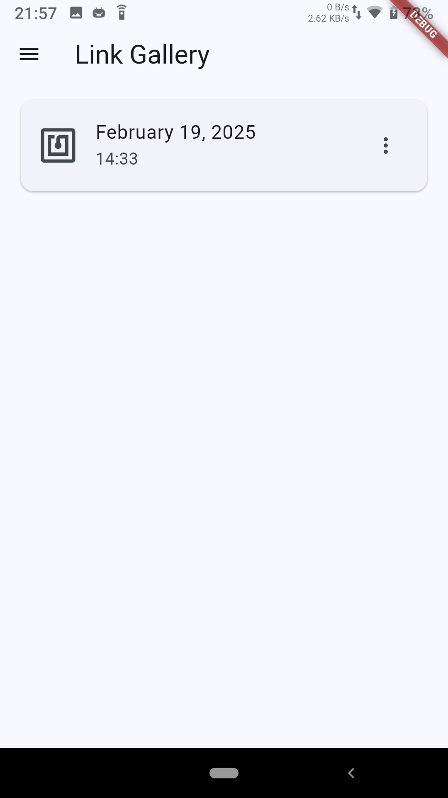
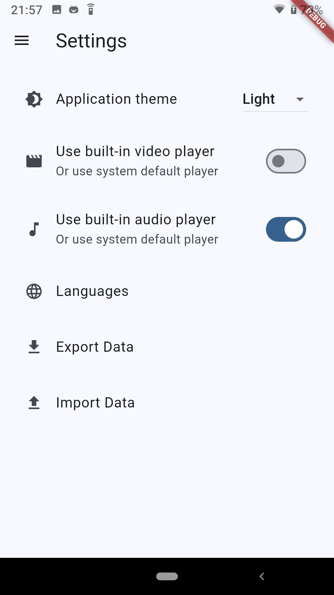
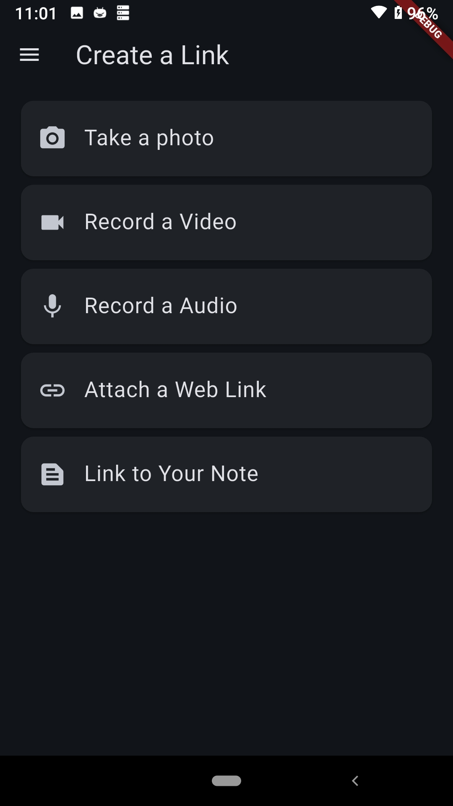
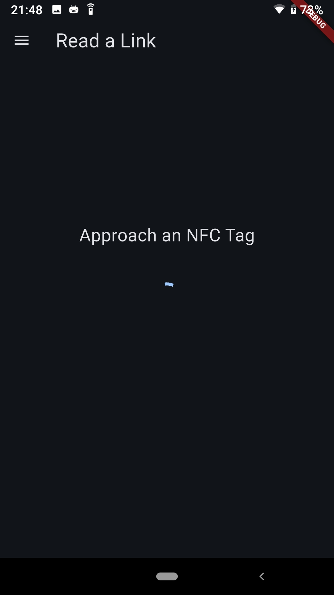
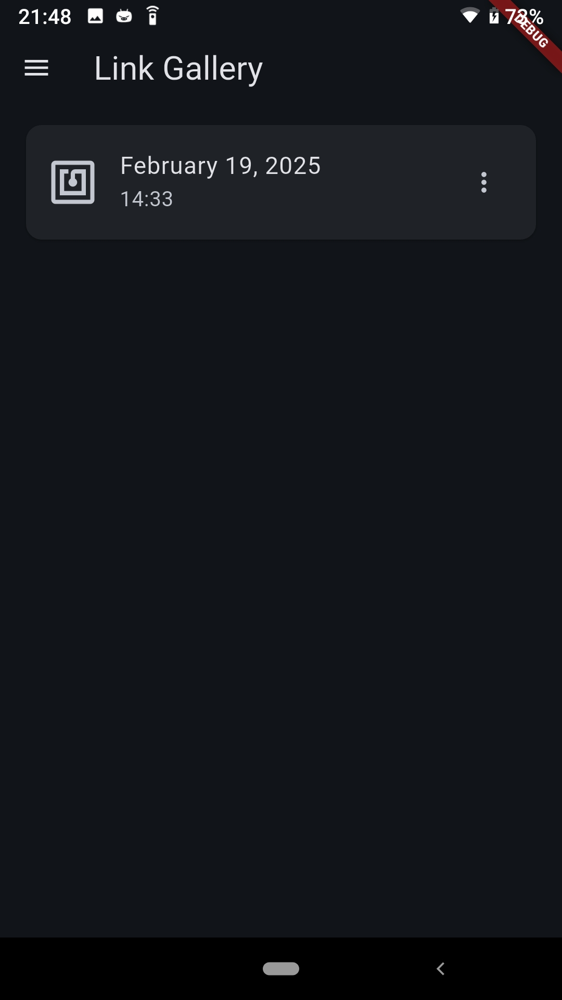
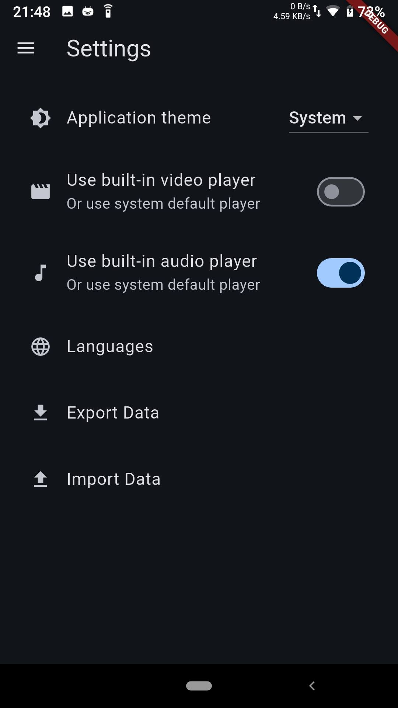

     
    
    <h1>NFC PLinkD</h1>
    <a href="README_zh.md">中文介绍</a> | 
    <a href="https://github.com/BHznJNs/NFC-PLinkD/releases">Install</a> |
    <a href="https://github.com/BHznJNs/NFC-PLinkD/issues">Feedback</a>
     
     

An **NFC** application that helps you create **link**s between your **p**aper materials and **d**igital resources.

<iframe width="560" height="315" src="https://www.youtube.com/embed/Vr0gKqifdtM?si=baNPoc64yGQWrhrz" title="YouTube video player" frameborder="0" allow="accelerometer; autoplay; clipboard-write; encrypted-media; gyroscope; picture-in-picture; web-share" referrerpolicy="strict-origin-when-cross-origin" allowfullscreen></iframe>

## 🖼️ Screenshots

☀️ Light mode:

| Creating | Reading | Gallery | Settings |
| -------- | ------- | ------- | -------- |
|  |  |  |  |

🌙 Dark mode:

| Creating | Reading | Gallery | Settings |
| -------- | ------- | ------- | -------- |
|  |  |  |  |
