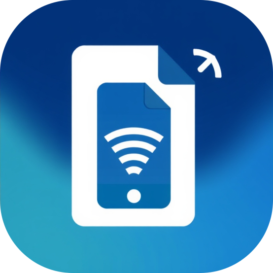

     
    
    <h1>电纸链接</h1>
    <a href="README.md">English</a> | 
    <a href="https://github.com/BHznJNs/NFC-PLinkD/issues">安装</a> |
    <a href="https://github.com/BHznJNs/NFC-PLinkD/releases">反馈</a>
     
     

这是一个通过 NFC 创建能够连接**纸**质材料和**电**子材料的**链接**。
