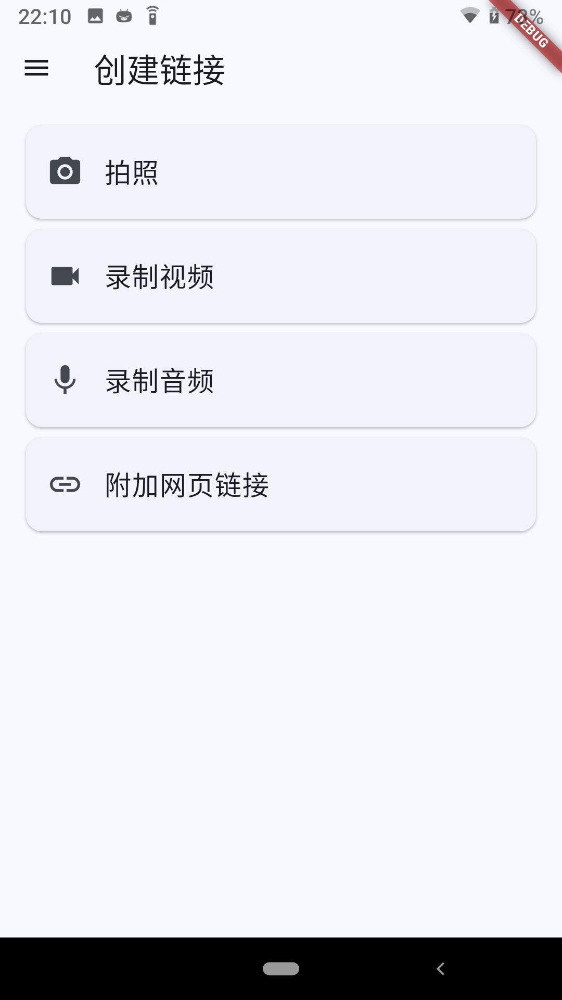
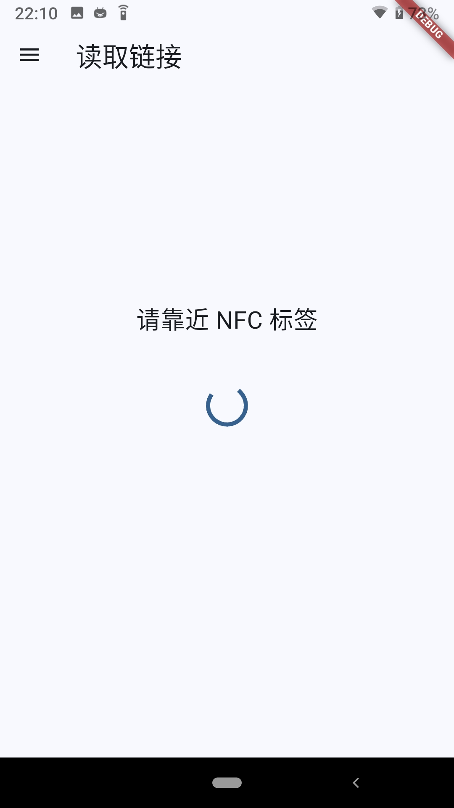
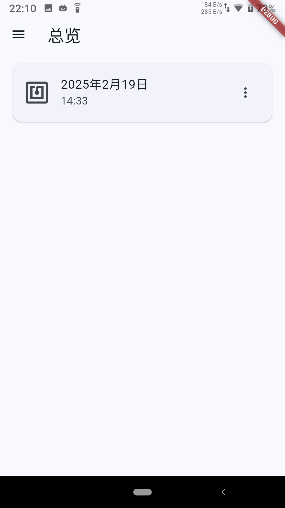
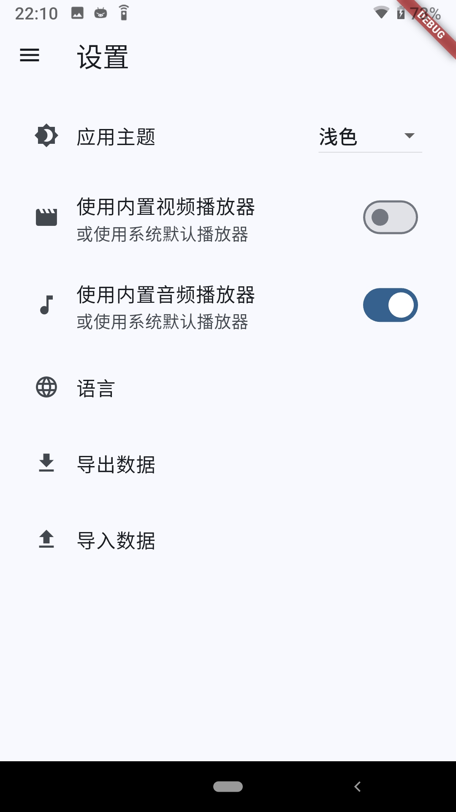
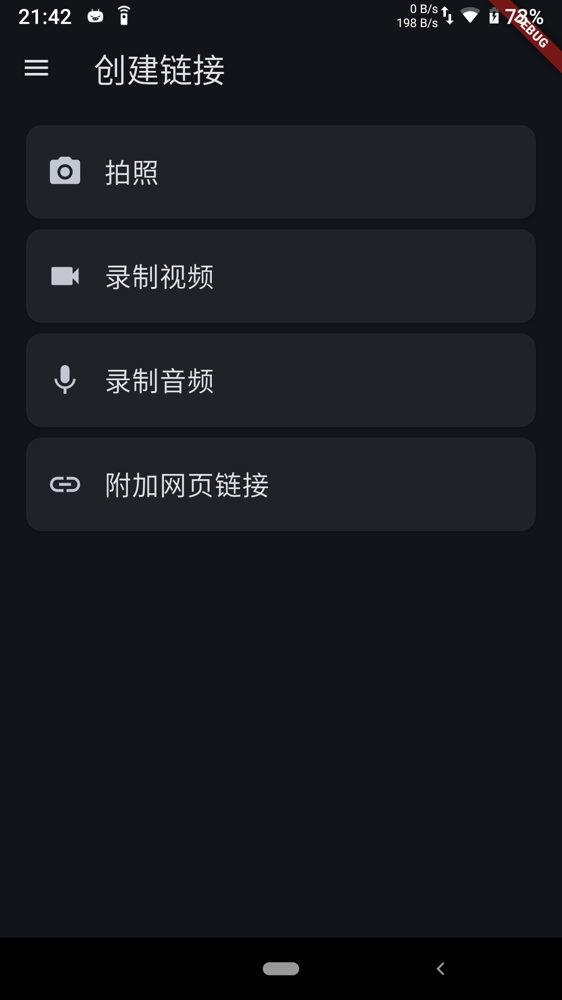
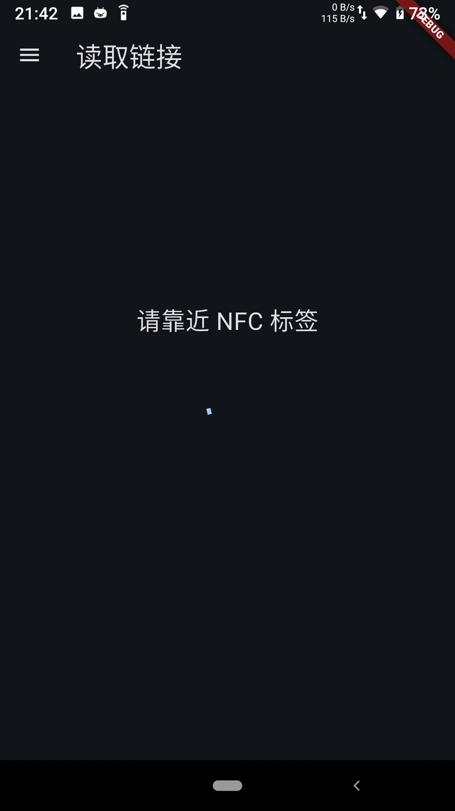
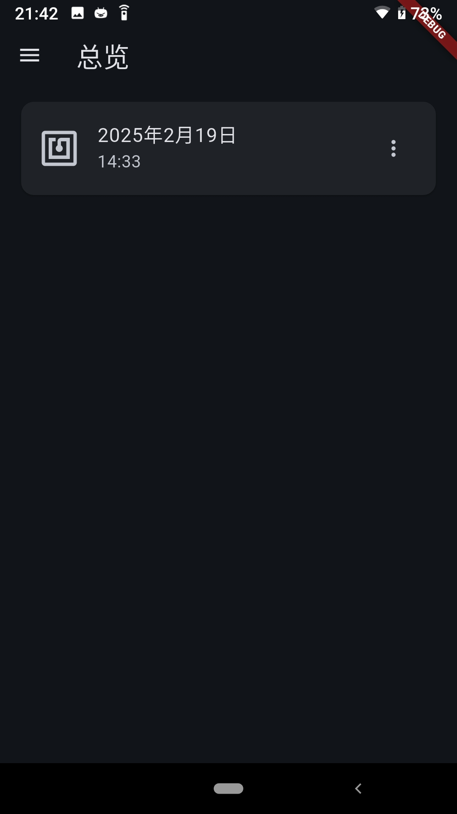
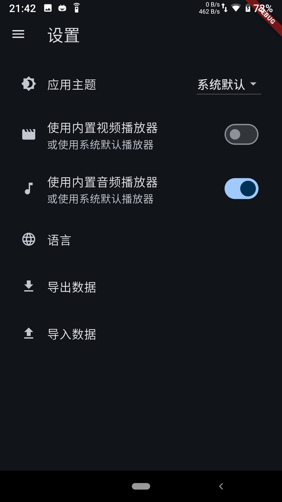

     
    
    <h1>电纸链接</h1>
    <a href="README.md">English</a> | 
    <a href="https://github.com/BHznJNs/NFC-PLinkD/releases">安装</a> |
    <a href="https://github.com/BHznJNs/NFC-PLinkD/install">反馈</a>
     
     

这是一个通过 NFC 创建能够连接**纸**质材料和**电**子材料的**链接**。

<iframe src="//player.bilibili.com/player.html?isOutside=true&aid=114051631878362&bvid=BV1NKA2eTEBJ&cid=25761027947&p=1" scrolling="no" border="0" frameborder="no" framespacing="0" allowfullscreen="true"></iframe>

## 🖼️ 屏幕截图

☀️ 日间模式:

| 创建链接 | 读取链接 | 总览 | 设置 |
| ------ | ------- | ---- | ---- |
|  |  |  |  |

🌙 夜间模式:

| 创建链接 | 读取链接 | 总览 | 设置 |
| ------ | ------- | ---- | ---- |
|  |  |  |  |
